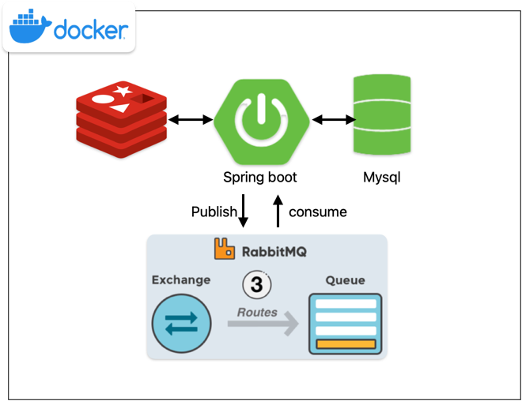

# 백엔드 성능 개선 프로젝트

Kotlin 언어와 Spring boot 프레임워크 기반으로 게시판 조회에 필요한 기능들을 구현하고 성능을 개선하는 프로젝트이다.
JPA사용, 데이터 캐싱, 비동기 이벤트 등을 이용해 성능 향상을 위한 작업을 진행한다.
성능 테스트의 경우 nGrinder를 이용해 TPS를 측정한다.

### architecture


### library
- kotlin 1.8.22
- spring boot 3.1.7
- spring data jpa 3.1.7
- querydsl 5.0
- spring data redis 3.1.7
- spring data amqp 3.1.7

### app
``` docker-compose up -d ```

### 기능 요구사항

- 게시글 생성/수정
- 게시글 삭제
- 게시글 상세 조회(게시글, 댓글, 태그, 좋아요)
- 게시글 목록 조회(게시글, 댓글, 태그, 좋아요)
  - 필터 : 게시글 정보로 조회
  - 핕터 : 태그로 조회
  - 좋아요 개수 조회
- 댓글 생성/수정(비동기 이벤트 발행)
- 댓글 삭제
- 좋아요 생성(캐시 저장)
- 좋아요 조회(캐시 조회)

### 성능 개선

- 태그 검색(fetch join), 게시글 목록 조회(fetch_batch_size) 설정 => n + 1 문제 개선
- 좋아요 변경 시 캐시 저장, 좋아요 조회 성능을 향상시키기 위한 Cache-Aside 캐시 전략
  (캐시 크기와 쓰기 작업이 증가하는 단점이 있지만 게시판의 좋아요는 읽는 경우가 더 많으므로,
   캐시 크기와 쓰기 작업 증가의 문제보다 얻는 이득이 더 많을 것이다.)
- 비동기 이벤트 발행(빠른 응답)

### 성능 테스트
게시글 페이징 리스트 조회, 단일건 최종 평균 응답 시간 4ms
macbook air m1 노트북 기준 ngrinder 설치 후 TPS 측정 테스트 진행

docker tomcat 컨테이너 사양 cpu 1 mem 1G, tomcat 디폴트 설정
- 가상 유저 수 296 : 평균 TPS 86.6, 평균 시간 2,474, 테스트 시간 2분
- 가상 유저 수 296 : count query가 필요없으므로 Page(fecthResult) -> Slice(fetch)로 변경 평균 TPS 144.9, 평균 시간 1,621, 테스트 시간 2분
- 가상 유저 수 296 : orderBy 컬럼 created_at index 설정, 평균 TPS 164, 평균 시간 1,574, 테스트 시간 2분

docker tomcat 컨테이너 사양 cpu 2 mem 1G, tomcat 디폴트 설정
- 가상 유저 수 296 : 평균 TPS 245.8, 평균 시간 951, 테스트 시간 2분
- 가상 유저 수 296 : 평균 TPS 280.4, 평균 시간 801, 테스트 시간 2분
- 가상 유저 수 500 : QueryDsl where절 subquery 조회 변경, 평균 TPS 175.3, 평균 시간 1,432, 테스트 시간 2분
- 가상 유저 수 500 : No offset 조회 변경, 평균 TPS 415.7, 평균 시간 640.94, 테스트 시간 2분
- 가상 유저 수 500 : 게시글 목록 자체 cache 저장/조회, 평균 TPS 712.0, 평균 시간 599.27, 테스트 시간 2분

### 테스트

Behavior Driven Development 테스트 스타일 기반 테스트

- kotest(junit5) : Behavior 서비스 테스트
- kotest(testContainer) : 컨테이너 테스트
